# <div align="center"><p>Jarkom-Modul-2-D06-2023</p></div>

## Anggota Kelompok

| Nama                               | NRP        |
| ---------------------------------- | ---------- |
| Achmad Khosyi’ Assajjad Ramandanta | 5025211007 |
| Daud Dhiya' Rozaan                 | 5025211021 |

## No 1
Yudhistira akan digunakan sebagai DNS Master, Werkudara sebagai DNS Slave, Arjuna merupakan Load Balancer yang terdiri dari beberapa Web Server yaitu Prabakusuma, Abimanyu, dan Wisanggeni. Buatlah topologi dengan pembagian sebagai berikut.

**Jawab**

`SS Topologi`


### Network Configuration
- Pandudewanata
```
auto eth0
iface eth0 inet dhcp

auto eth1
iface eth1 inet static
	address 192.194.1.1
	netmask 255.255.255.0

auto eth2
iface eth2 inet static
	address 192.194.2.1
	netmask 255.255.255.0

auto eth3
iface eth3 inet static
	address 192.194.3.1
	netmask 255.255.255.0
```
- DNSSLAVE-Werkudara
```
auto eth0
iface eth0 inet static
	address 192.194.1.2
	netmask 255.255.255.0
	gateway 192.194.1.1
```
- DNSMASTER-Yudhistira
```
auto eth0
iface eth0 inet static
	address 192.194.1.3
	netmask 255.255.255.0
	gateway 192.194.1.1
```
- Client-Nakula
```
auto eth0
iface eth0 inet static
	address 192.194.2.2
	netmask 255.255.255.0
	gateway 192.194.2.1
```
- Client-Sadewa
```
auto eth0
iface eth0 inet static
	address 192.194.2.3
	netmask 255.255.255.0
	gateway 192.194.2.1
```
- Abimanyu
```
auto eth0
iface eth0 inet static
	address 192.194.3.2
	netmask 255.255.255.0
	gateway 192.194.3.1
```
- Prabukusuma
```
auto eth0
iface eth0 inet static
	address 192.194.3.3
	netmask 255.255.255.0
	gateway 192.194.3.1
```
- Wisanggeni
```
auto eth0
iface eth0 inet static
	address 192.194.3.4
	netmask 255.255.255.0
	gateway 192.194.3.1
```
- LB-Arjuna
```
auto eth0
iface eth0 inet static
	address 192.194.3.5
	netmask 255.255.255.0
	gateway 192.194.3.1
```
Setelah melakukan konfigurasi, tulis command berikut di `Pandudewanata`
- Pandudewanata
```
iptables -t nat -A POSTROUTING -o eth0 -j MASQUERADE -s 192.194.0.0/16
```
Lalu tulis command berikut ke semua node
```
echo nameserver 192.168.122.1 > /etc/resolv.conf
```

`SS Hasil`??

## No 2
Buatlah website utama pada node arjuna dengan akses ke arjuna.yyy.com dengan alias www.arjuna.yyy.com dengan yyy merupakan kode kelompok.

**Jawab**

Setup terlebih dahulu di `DNSMASTER`
- DNSMASTER-Yudhistira
```
apt-get update
apt-get install bind9 -y

echo "zone \"arjuna.D06.com\" { 
  type master; 
  file \"/etc/bind/jarkom/arjuna.D06.com\";
};" >/etc/bind/named.conf.local

mkdir /etc/bind/jarkom
cp /etc/bind/db.local /etc/bind/jarkom/arjuna.D06.com

echo "
;
; BIND data file for local loopback interface
;
\$TTL   604800
@       IN      SOA     arjuna.D06.com. root.arjuna.D06.com. (
                        2023100101      ; Serial
                            604800      ; Refresh
                             86400      ; Retry
                           2419200      ; Expire
                            604800 )    ; Negative Cache TTL
;
@       IN      NS      arjuna.D06.com.
@       IN      A       192.194.3.5     ; IP LB-ARJUNA
www     IN      CNAME   arjuna.D06.com.
@       IN      AAAA    ::1
" >/etc/bind/jarkom/arjuna.D06.com

service bind9 restart
```
Tuliskan command berikut pada `Client`
- Client-Nakula & Client-Sadewa
```
echo "
# nameserver 192.168.122.1 # IP Pandudewanata
nameserver 192.194.1.3 # IP DNSMASTER
" >/etc/resolv.conf

ping arjuna.D06.com -c 5
ping www.arjuna.D06.com -c 5
```

Apabila berhasil maka pada console `Client` akan muncul sebagai berikut

`SS Hasil`


## No 3
Dengan cara yang sama seperti soal nomor 2, buatlah website utama dengan akses ke abimanyu.yyy.com dan alias www.abimanyu.yyy.com.

**Jawab**

Setup terlebih dahulu di `DNSMASTER`

- DNSMASTER-Yudhistira
```
echo "zone \"abimanyu.D06.com\" { 
  type master; 
  file \"/etc/bind/jarkom/abimanyu.D06.com\"; 
};" >>/etc/bind/named.conf.local

cp /etc/bind/db.local /etc/bind/jarkom/abimanyu.D06.com

echo "
;
; BIND data file for local loopback interface
;
\$TTL   604800
@       IN      SOA     abimanyu.D06.com. root.abimanyu.D06.com. (
                        2023100101      ; Serial
                            604800      ; Refresh
                             86400      ; Retry
                           2419200      ; Expire
                            604800 )    ; Negative Cache TTL
;
@       IN      NS      abimanyu.D06.com.
@       IN      A       192.194.3.2     ; IP Abimanyu
www     IN      CNAME   abimanyu.D06.com.
@       IN      AAAA    ::1
" >/etc/bind/jarkom/abimanyu.D06.com

service bind9 restart
```
Tuliskan command berikut pada `Client`
- Client-Nakula & Client-Sadewa
```
ping abimanyu.D06.com -c 5
ping www.abimanyu.D06.com -c 5
```
Apabila berhasil maka pada console `Client` akan muncul sebagai berikut

`SS Hasil`


## No 4
Kemudian, karena terdapat beberapa web yang harus di-deploy, buatlah subdomain parikesit.abimanyu.yyy.com yang diatur DNS-nya di Yudhistira dan mengarah ke Abimanyu.

**Jawab**

Setup terlebih dahulu di `DNSMASTER`

- DNSMASTER-Yudhistira
```
echo "
;
; BIND data file for local loopback interface
;
\$TTL   604800
@       IN      SOA     abimanyu.D06.com. root.abimanyu.D06.com. (
                        2023100101      ; Serial
                            604800      ; Refresh
                             86400      ; Retry
                           2419200      ; Expire
                            604800 )    ; Negative Cache TTL
;
@       IN      NS      abimanyu.D06.com.
@       IN      A       192.194.3.2     ; IP Abimanyu
www     IN      CNAME   abimanyu.D06.com.
parikesit IN    A       192.194.3.2     ; IP Abimanyu
@       IN      AAAA    ::1
" >/etc/bind/jarkom/abimanyu.D06.com

service bind9 restart
```

Tuliskan command berikut pada `Client`
- Client-Nakula & Client-Sadewa
```
ping parikesit.abimanyu.D06.com -c 5
```
Apabila berhasil maka pada console `Client` akan muncul sebagai berikut

`SS Hasil`


## No 5

Buat juga reverse domain untuk domain utama. (Abimanyu saja yang direverse)

**Jawab**

Setup terlebih dahulu di `DNSMASTER`

- DNSMASTER-Yudhistira
```
echo "zone \"3.194.192.in-addr.arpa\" {
  type master; 
  file \"/etc/bind/jarkom/3.194.192.in-addr.arpa\"; 
};" >>/etc/bind/named.conf.local

cp /etc/bind/db.local /etc/bind/jarkom/3.194.192.in-addr.arpa

echo "
;
; BIND data file for local loopback interface
;
\$TTL   604800
@       IN      SOA     abimanyu.D06.com. root.abimanyu.D06.com. (
                        2023100101      ; Serial
                            604800      ; Refresh
                             86400      ; Retry
                           2419200      ; Expire
                            604800 )    ; Negative Cache TTL
;
3.194.192.in-addr.arpa.  IN      NS      abimanyu.D06.com.
2                        IN      PTR     abimanyu.D06.com.
" >/etc/bind/jarkom/3.194.192.in-addr.arpa

service bind9 restart
```

Tuliskan command berikut pada `Client`
- Client-Nakula & Client-Sadewa
```
echo "
nameserver 192.168.122.1 # IP Pandudewanata
# nameserver 192.194.1.3 # IP DNSMASTER
" >/etc/resolv.conf

apt-get update
apt-get install dnsutils -y

echo "
# nameserver 192.168.122.1 # IP Pandudewanata
nameserver 192.194.1.3 # IP DNSMASTER
" >/etc/resolv.conf

host -t PTR "192.194.3.2" # IP Abimanyu
```
Apabila berhasil maka pada console `Client` akan muncul sebagai berikut

`SS Hasil`


## No 6

Agar dapat tetap dihubungi ketika DNS Server Yudhistira bermasalah, buat juga Werkudara sebagai DNS Slave untuk domain utama.

**Jawab**

Setup terlebih dahulu di `DNSMASTER`

- DNSMASTER-Yudhistira
```
# No 6
echo "
zone \"abimanyu.D06.com\" {
    type master;
    notify yes;
    also-notify { 192.194.1.2; }; # IP DNSSLAVE
    allow-transfer { 192.194.1.2; }; # IP DNSSLAVE
    file \"/etc/bind/jarkom/abimanyu.D06.com\";
};

zone \"arjuna.D06.com\" { 
  type master; 
  file \"/etc/bind/jarkom/arjuna.D06.com\";
};

zone \"1.194.192.in-addr.arpa\" {
  type master;
  file \"/etc/bind/jarkom/1.194.192.in-addr.arpa\"; 
};
" >/etc/bind/named.conf.local

service bind9 restart
```

Lalu setup di `DNSSLAVE`

- DNSSLAVE-Werkudara
```
apt-get update
apt-get install bind9 -y

echo "
zone \"abimanyu.D06.com\" {
    type slave;
    masters { 192.194.1.3; }; # IP DNSMASTER
    file \"/var/lib/bind/abimanyu.D06.com\";
};" >/etc/bind/named.conf.local

service bind9 restart
```

Untuk melakukan pengecekan apakah berhasil atau tidak, stop dulu bind9 di `DNSMASTER`, lalu tuliskan command berikut di `Client`

- DNSMASTER-Yudhistira
```
service bind9 stop
```

- Client-Nakula & Client-Sadewa
```
echo "
nameserver 192.194.1.3 # IP DNSMASTER
nameserver 192.194.1.2 # IP DNSSLAVE
" >/etc/resolv.conf
```
Pengecekan pada `Client`
```
ping abimanyu.D06.com -c 3
```
Apabila berhasil maka pada console `Client` akan muncul sebagai berikut

`SS Hasil`


## No 7
Seperti yang kita tahu karena banyak sekali informasi yang harus diterima, buatlah subdomain khusus untuk perang yaitu baratayuda.abimanyu.yyy.com dengan alias www.baratayuda.abimanyu.yyy.com yang didelegasikan dari Yudhistira ke Werkudara dengan IP menuju ke Abimanyu dalam folder Baratayuda.

**Jawab**

Setup terlebih dahulu di `DNSMASTER`

- DNSMASTER-Yudhistira
```
echo ";
; BIND data file for local loopback interface
;
\$TTL    604800
@       IN      SOA     abimanyu.D06.com. root.abimanyu.D06.com. (
                     2023100101         ; Serial
                         604800         ; Refresh
                          86400         ; Retry
                        2419200         ; Expire
                         604800 )       ; Negative Cache TTL
;
@       IN      NS      abimanyu.D06.com.
@       IN      A       192.194.3.2       ; IP Abimanyu
www     IN      CNAME   abimanyu.D06.com.
parikesit  IN   A       192.194.3.2       ; IP Abimanyu
ns1     IN      A       192.194.1.3       ; IP DNSMASTER
baratayuda IN   NS      ns1
@       IN      AAAA    ::1
" >/etc/bind/jarkom/abimanyu.D06.com

echo 'options {
  directory "/var/cache/bind";
  allow-query{any;};
  auth-nxdomain no;    # conform to RFC1035
  listen-on-v6 { any; };
};' >/etc/bind/named.conf.options

service bind9 restart
```

Lalu setup di `DNSSLAVE`

- DNSSLAVE-Werkudara
```
echo 'options {
        directory "/var/cache/bind";
        allow-query{any;};
        auth-nxdomain no;    # conform to RFC1035
        listen-on-v6 { any; };
};' >/etc/bind/named.conf.options

echo "zone \"baratayuda.abimanyu.D06.com\" {
    type master;
    file \"/etc/bind/baratayuda/baratayuda.abimanyu.D06.com\";
};" >>/etc/bind/named.conf.local

mkdir /etc/bind/baratayuda
cp /etc/bind/db.local /etc/bind/baratayuda/baratayuda.abimanyu.D06.com

echo ';
; BIND data file for local loopback interface
;
$TTL    604800
@       IN      SOA     baratayuda.abimanyu.D06.com. root.baratayuda.abimanyu.D06.com. (
                     2023100101         ; Serial
                         604800         ; Refresh
                          86400         ; Retry
                        2419200         ; Expire
                         604800 )       ; Negative Cache TTL
;
@       IN      NS      baratayuda.abimanyu.D06.com.
@       IN      A       192.194.1.2       ; IP DNSSLAVE
www     IN      CNAME   baratayuda.abimanyu.D06.com.
@       IN      AAAA    ::1' >/etc/bind/baratayuda/baratayuda.abimanyu.D06.com

service bind9 restart
```

Tuliskan command berikut pada `Client`
- Client-Nakula & Client-Sadewa
```
ping baratayuda.abimanyu.D06.com -c 3
ping www.baratayuda.abimanyu.D06.com -c 3
```
Apabila berhasil maka pada console `Client` akan muncul sebagai berikut

`SS Hasil`


## No 8
Untuk informasi yang lebih spesifik mengenai Ranjapan Baratayuda, buatlah subdomain melalui Werkudara dengan akses rjp.baratayuda.abimanyu.yyy.com dengan alias www.rjp.baratayuda.abimanyu.yyy.com yang mengarah ke Abimanyu.

**Jawab**

Setup terlebih dahulu di `DNSSLAVE`

- DNSSLAVE-Werkudara
```
echo '
;
; BIND data file for local loopback interface
;
$TTL    604800
@       IN      SOA     baratayuda.abimanyu.D06.com. root.baratayuda.abimanyu.D06.com. (
                     2023100101         ; Serial
                         604800         ; Refresh
                          86400         ; Retry
                        2419200         ; Expire
                         604800 )       ; Negative Cache TTL
;
@       IN      NS      baratayuda.abimanyu.D06.com.
@       IN      A       192.194.1.2       ; IP DNSSLAVE
www     IN      CNAME   baratayuda.abimanyu.D06.com.
rjp     IN      A       192.194.3.2       ; IP Abimanyu
www.rjp     IN      CNAME   rjp.baratayuda.abimanyu.D06.com.
@       IN      AAAA    ::1
' >/etc/bind/baratayuda/baratayuda.abimanyu.D06.com

service bind9 restart
```

Tuliskan command berikut pada `Client`
- Client-Nakula & Client-Sadewa
```
ping rjp.baratayuda.abimanyu.D06.com -c 3
ping www.rjp.baratayuda.abimanyu.D06.com -c 3
```
Apabila berhasil maka pada console `Client` akan muncul sebagai berikut

`SS Hasil`


## No 9
Arjuna merupakan suatu Load Balancer Nginx dengan tiga worker (yang juga menggunakan nginx sebagai webserver) yaitu Prabakusuma, Abimanyu, dan Wisanggeni. Lakukan deployment pada masing-masing worker.

**Jawab**

Pada `LB-ARJUNA`, kita terlebih dahulu menuliskan command berikut

- LB-ARJUNA
```
echo "
nameserver 192.168.122.1
nameserver 192.194.1.3
" >/etc/resolv.conf

apt-get update
apt-get install bind9 nginx -y
service nginx start
```

Selanjutnya pada masing-masing worker, tuliskan command berikut

- Abimanyu, Prabakusuma, Wisanggeni
```
echo "
nameserver 192.168.122.1
nameserver 192.194.1.3
" >/etc/resolv.conf

apt-get update && apt install nginx php php-fpm -y
service nginx start
service php7.0-fpm start

mkdir /var/www/jarkom
echo "
<?php
echo \"Halo, Kamu berada di (Nama Webserver)\";
?>
" >/var/www/jarkom/index.php

echo "
server {
  listen 80;

  root /var/www/jarkom;

  index index.php index.html index.htm;
  server_name arjuna.D06.com;

  location / {
    try_files \$uri \$uri/ /index.php?\$query_string;
  }

  # pass PHP scripts to FastCGI server
  location ~ \.php$ {
  include snippets/fastcgi-php.conf;
  fastcgi_pass unix:/var/run/php/php7.0-fpm.sock;
  }

  location ~ /\.ht {
    deny all;
  }

  error_log /var/log/nginx/jarkom_error.log;
  access_log /var/log/nginx/jarkom_access.log;
}
" >/etc/nginx/sites-available/jarkom

ln -s /etc/nginx/sites-available/jarkom /etc/nginx/sites-enabled
rm /etc/nginx/sites-enabled/default
service nginx restart
nginx -t
```

Selanjutnya, kembali lagi ke `LB-ARJUNA` dan tuliskan command berikut
```
echo "
# Default menggunakan Round Robin
upstream webD06  {
  server 192.194.3.2; # IP Abimanyu
  server 192.194.3.3; # IP Prabukusuma
  server 192.194.3.4; # IP Wisanggeni
}

server {
  listen 80;
  server_name arjuna.D06.com www.arjuna.D06.com;
  location / {
  proxy_pass http://webD06;
  }
}
" >/etc/nginx/sites-available/lb-jarkom

ln -s /etc/nginx/sites-available/lb-jarkom /etc/nginx/sites-enabled
rm /etc/nginx/sites-enabled/default
service nginx restart && nginx -t
```

- Client Nakula & Sadewa
```
apt-get update
apt-get install lynx -y
```
Pengecekan pada `Client`
```
lynx http://arjuna.D06.com
```

Apabila berhasil maka pada console `Client` akan muncul sebagai berikut

`SS Hasil`


## No 10
Kemudian gunakan algoritma Round Robin untuk Load Balancer pada Arjuna. Gunakan server_name pada soal nomor 1. Untuk melakukan pengecekan akses alamat web tersebut kemudian pastikan worker yang digunakan untuk menangani permintaan akan berganti ganti secara acak. Untuk webserver di masing-masing worker wajib berjalan di port 8001-8003. Contoh

    - Prabakusuma:8001
    - Abimanyu:8002
    - Wisanggeni:8003

**Jawab**

Setup terlebih dahulu pada bagian `LB-ARJUNA`

- LB-ARJUNA
```
echo "
# Default menggunakan Round Robin
upstream webD06  {
  server 192.194.3.2:8001; # IP Abimanyu
  server 192.194.3.3:8002; # IP Prabukusuma
  server 192.194.3.4:8003; # IP Wisanggeni
}

server {
  listen 80;
  server_name arjuna.D06.com www.arjuna.D06.com;
  location / {
  proxy_pass http://webD06;
  }
}
" >/etc/nginx/sites-available/lb-jarkom

ln -s /etc/nginx/sites-available/lb-jarkom /etc/nginx/sites-enabled
service nginx restart
```

Berikutnya, tulisakan command berikut pada tiap worker, dengan keterangan X adalah angka terakhir dari port masing-masing worker

```
echo "
server {
  listen 800X;

  root /var/www/jarkom;

  index index.php index.html index.htm;
  server_name arjuna.D06.com;

  location / {
    try_files \$uri \$uri/ /index.php?\$query_string;
  }

  # pass PHP scripts to FastCGI server
  location ~ \.php$ {
  include snippets/fastcgi-php.conf;
  fastcgi_pass unix:/var/run/php/php7.0-fpm.sock;
  }

  location ~ /\.ht {
    deny all;
  }

  error_log /var/log/nginx/jarkom_error.log;
  access_log /var/log/nginx/jarkom_access.log;
}
" >/etc/nginx/sites-available/jarkom

apt-get update && apt-get install wget -y && apt-get install unzip -y

wget --no-check-certificate "https://drive.google.com/uc?export=download&id=17tAM_XDKYWDvF-JJix1x7txvTBEax7vX" -O /var/www/jarkom/arjuna.D06.com.zip

unzip /var/www/jarkom/arjuna.D06.com.zip -d /var/www/jarkom/
mv /var/www/jarkom/arjuna.yyy.com/index.php /var/www/jarkom/

service nginx restart && nginx -t
```

- Client Nakula & Sadewa
```
lynx http://arjuna.D06.com
```

Apabila berhasil maka pada console `Client` akan muncul sebagai berikut

`SS Hasil`


## No 11
Selain menggunakan Nginx, lakukan konfigurasi Apache Web Server pada worker Abimanyu dengan web server www.abimanyu.yyy.com. Pertama dibutuhkan web server dengan DocumentRoot pada /var/www/abimanyu.yyy

**Jawab**

Setup terlebih dahulu di worker `Abimanyu`

- Abimanyu
```
apt-get install apache2 -y
apache2 -v
service apache2 start

apt-get install php -y
php -v

apt-get install libapache2-mod-php7.0 -y

mkdir /var/www/abimanyu.D06

cp /etc/apache2/sites-available/000-default.conf /etc/apache2/sites-available/abimanyu.D06.com.conf
rm /etc/apache2/sites-available/000-default.conf

echo "<VirtualHost *:80>
  ServerName abimanyu.D06.com
  ServerAlias www.abimanyu.D06.com
  ServerAdmin webmaster@localhost
  DocumentRoot /var/www/abimanyu.D06

  ErrorLog \${APACHE_LOG_DIR}/error.log
  CustomLog \${APACHE_LOG_DIR}/access.log combined
</VirtualHost>" >/etc/apache2/sites-available/abimanyu.D06.com.conf

wget --no-check-certificate "https://drive.google.com/uc?export=download&id=1a4V23hwK9S7hQEDEcv9FL14UkkrHc-Zc" -O /var/www/abimanyu.D06/abimanyu.D06.com.zip

unzip /var/www/abimanyu.D06/abimanyu.D06.com.zip -d /var/www/abimanyu.D06/

mv /var/www/abimanyu.D06/abimanyu.yyy.com/home.html /var/www/abimanyu.D06/
mv /var/www/abimanyu.D06/abimanyu.yyy.com/abimanyu.webp /var/www/abimanyu.D06/
mv /var/www/abimanyu.D06/abimanyu.yyy.com/index.php /var/www/abimanyu.D06/

a2ensite abimanyu.D06.com.conf
service apache2 reload
service apache2 restart
```

- Client Nakula & Sadewa
```
lynx abimanyu.D06.com
lynx abimanyu.D06.com/index.php/home
```

Apabila berhasil maka pada console `Client` akan muncul sebagai berikut

`SS Hasil`

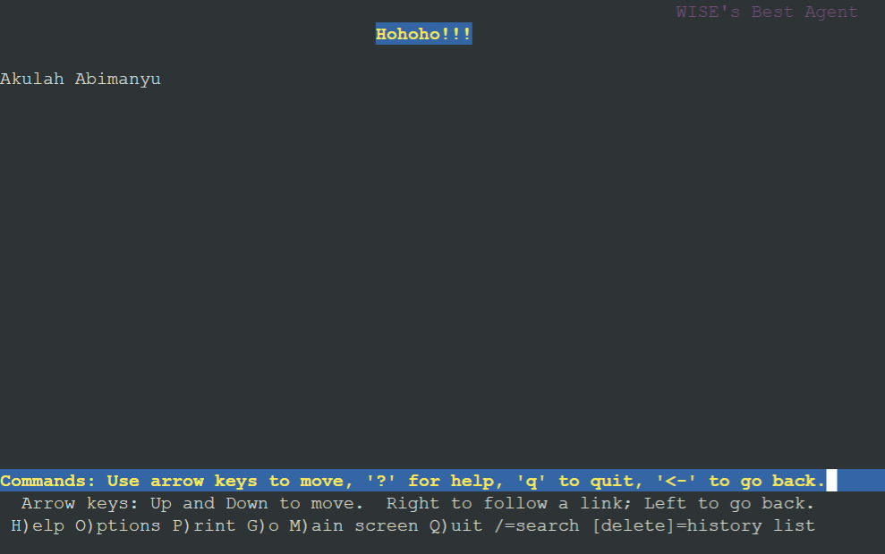

## No 12
Setelah itu ubahlah agar url www.abimanyu.yyy.com/index.php/home menjadi www.abimanyu.yyy.com/home.

**Jawab**

Setup terlebih dahulu di worker `Abimanyu`

- Abimanyu
```
echo "
<Directory /var/www/abimanyu.D06/index.php/home>
    Options +Indexes
</Directory>

Alias \"/home\" \"/var/www/abimanyu.D06/index.php/home\"
" >>/etc/apache2/sites-available/abimanyu.D06.com.conf
service apache2 restart
```

- Client Nakula & Sadewa
```
lynx abimanyu.D06.com
lynx abimanyu.D06.com/index.php/home
```

Apabila berhasil maka pada console `Client` akan muncul sebagai berikut

`SS Hasil`

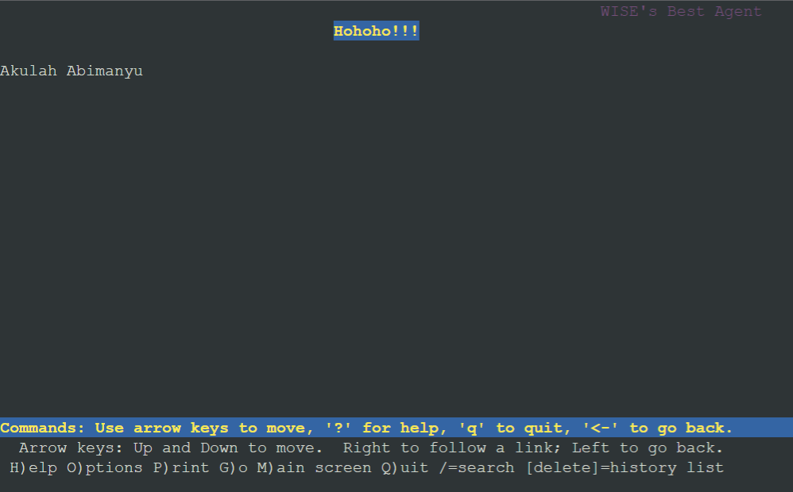

## No 13
Selain itu, pada subdomain www.parikesit.abimanyu.yyy.com, DocumentRoot disimpan pada /var/www/parikesit.abimanyu.yyy

**Jawab**

Setup terlebih dahulu di `DNSMASTER`

- DNSMASTER-Yudhistira
```
echo ";
; BIND data file for local loopback interface
;
\$TTL    604800
@       IN      SOA     abimanyu.D06.com. root.abimanyu.D06.com. (
                     2023100101         ; Serial
                         604800         ; Refresh
                          86400         ; Retry
                        2419200         ; Expire
                         604800 )       ; Negative Cache TTL
;
@       IN      NS      abimanyu.D06.com.
@       IN      A       192.194.3.2       ; IP Abimanyu
www     IN      CNAME   abimanyu.D06.com.
parikesit  IN   A       192.194.3.2       ; IP Abimanyu
www.parikesit IN      CNAME   parikesit.abimanyu.D06.com.
ns1     IN      A       192.194.1.3       ; IP DNSMASTER
baratayuda IN   NS      ns1
@       IN      AAAA    ::1
" >/etc/bind/jarkom/abimanyu.D06.com
```

Lalu tuliskan command berikut di worker `Abimanyu`
- Abimanyu
```
mkdir /var/www/parikesit.abimanyu.D06

echo "
<VirtualHost *:80>
  ServerName parikesit.abimanyu.D06.com
  # ServerAlias www.parikesit.abimanyu.D06.com
  ServerAdmin webmaster@localhost
  DocumentRoot /var/www/parikesit.abimanyu.D06

  ErrorLog \${APACHE_LOG_DIR}/error.log
  CustomLog \${APACHE_LOG_DIR}/access.log combined
</VirtualHost>" >/etc/apache2/sites-available/parikesit.abimanyu.D06.com.conf

wget --no-check-certificate "https://drive.google.com/uc?export=download&id=1LdbYntiYVF_NVNgJis1GLCLPEGyIOreS" -O /var/www/parikesit.abimanyu.D06/parikesit.abimanyu.D06.com.zip

unzip /var/www/parikesit.abimanyu.D06/parikesit.abimanyu.D06.com.zip -d /var/www/parikesit.abimanyu.D06/

mv /var/www/parikesit.abimanyu.D06/parikesit.abimanyu.yyy.com/error /var/www/parikesit.abimanyu.D06/
mv /var/www/parikesit.abimanyu.D06/parikesit.abimanyu.yyy.com/public /var/www/parikesit.abimanyu.D06/

a2ensite parikesit.abimanyu.D06.com.conf
service apache2 reload
service apache2 restart
```

- Client Nakula & Sadewa
```
lynx parikesit.abimanyu.D06.com
```

Apabila berhasil maka pada console `Client` akan muncul sebagai berikut

`SS Hasil`

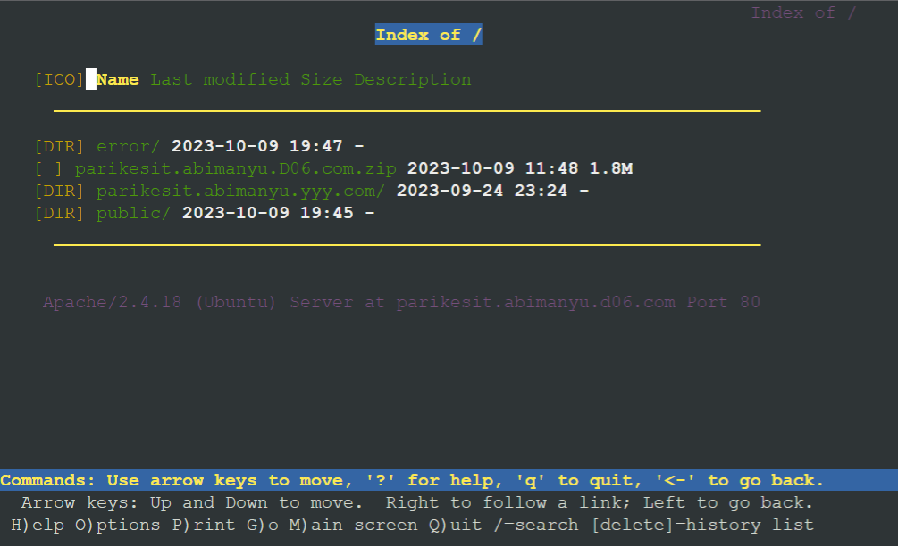

## No 14
Pada subdomain tersebut folder /public hanya dapat melakukan directory listing sedangkan pada folder /secret tidak dapat diakses (403 Forbidden).

**Jawab**

Setup terlebih dahulu di worker `Abimanyu`

- Abimanyu
```
mkdir /var/www/parikesit.abimanyu.D06/secret
cp /var/www/parikesit.abimanyu.D06/error/403.html /var/www/parikesit.abimanyu.D06/secret/403.html

echo "
<Directory /var/www/parikesit.abimanyu.D06/public>
  Options +Indexes
</Directory>
<Directory /var/www/parikesit.abimanyu.D06/secret>
  Options -Indexes
</Directory>
" >>/etc/apache2/sites-available/parikesit.abimanyu.D06.com.conf
```

- Client Nakula & Sadewa
```
lynx parikesit.abimanyu.D06.com/public
lynx parikesit.abimanyu.D06.com/secret
```

Apabila berhasil maka pada console `Client` akan muncul sebagai berikut

`SS Hasil`

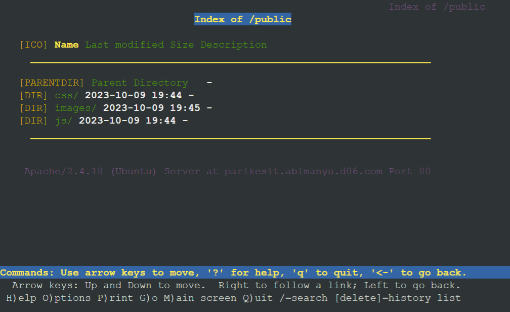

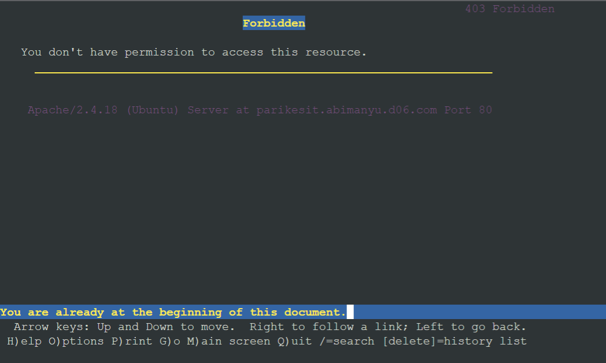

## No 15
Buatlah kustomisasi halaman error pada folder /error untuk mengganti error kode pada Apache. Error kode yang perlu diganti adalah 404 Not Found dan 403 Forbidden.

**Jawab**

Setup terlebih dahulu di worker `Abimanyu`

- Abimanyu
```
echo -e '
<html
  style="
    background-image: url('nyee.jpg');
    height: 100;
    background-repeat: no-repeat;
    background-size: 100% 100%;
    height: 100%;
    width: 100%;
  "
>
  <header>
    <h1 style="text-align: center; color: white">
      lmao ERROR 403 (Forbidden) BRO dari kelompok D06
    </h1>
  </header>
</html>
' >/var/www/parikesit.abimanyu.D06/error/403.html

echo -e '
<html
  style="
    background-image: url('nyee.jpg');
    height: 100;
    background-repeat: no-repeat;
    background-size: 100% 100%;
    height: 100%;
    width: 100%;
  "
>
  <header>
    <h1 style="text-align: center; color: white">
      lmao ERROR 404 (Forbidden) BRO dari kelompok D06
    </h1>
  </header>
</html>
' >/var/www/parikesit.abimanyu.D06/error/404.html

echo "
ErrorDocument 404 /error/404.html
ErrorDocument 403 /error/403.html
" >>/etc/apache2/sites-available/parikesit.abimanyu.D06.com.conf
```

- Client Nakula & Sadewa
```
lynx parikesit.abimanyu.D06.com/error          # untuk cek 403
lynx parikesit.abimanyu.D06.com/error/404.html # untuk cek 404
```

Apabila berhasil maka pada console `Client` akan muncul sebagai berikut

`SS Hasil`

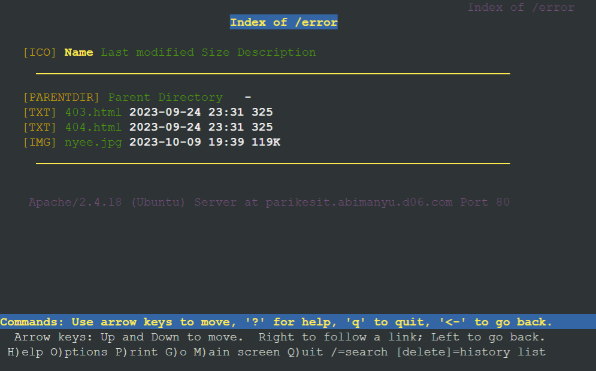

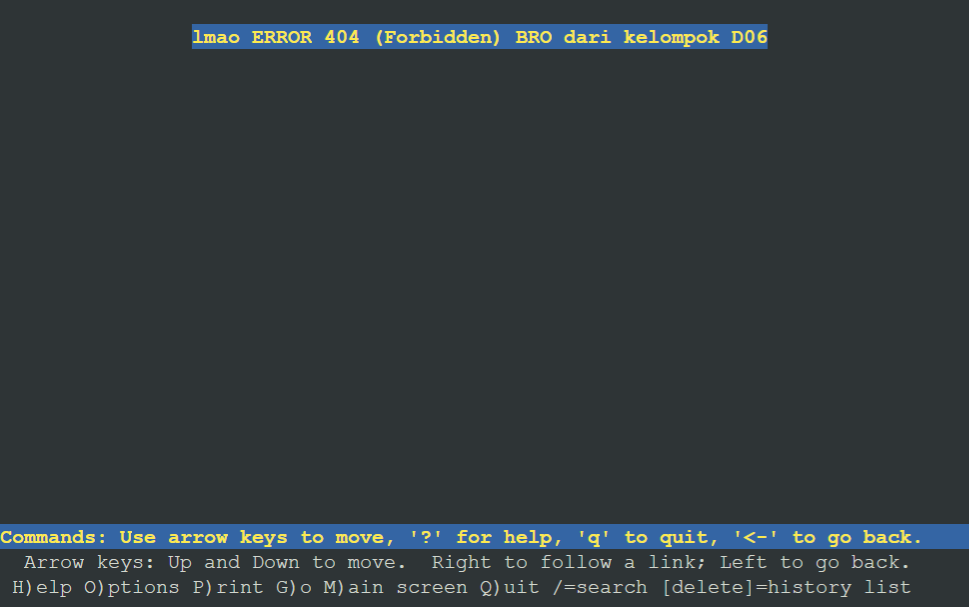

## No 16
Buatlah suatu konfigurasi virtual host agar file asset www.parikesit.abimanyu.yyy.com/public/js menjadi 
www.parikesit.abimanyu.yyy.com/js

**Jawab**

Setup terlebih dahulu di worker `Abimanyu`

- Abimanyu
```
echo "
Alias \"/js\" \"/var/www/parikesit.abimanyu.D06/public/js\"
" >>/etc/apache2/sites-available/parikesit.abimanyu.D06.com.conf
service apache2 restart
```

- Client Nakula & Sadewa
```
lynx parikesit.abimanyu.D06.com/js
lynx www.parikesit.abimanyu.D06.com/js
```

Apabila berhasil maka pada console `Client` akan muncul sebagai berikut

`SS Hasil`

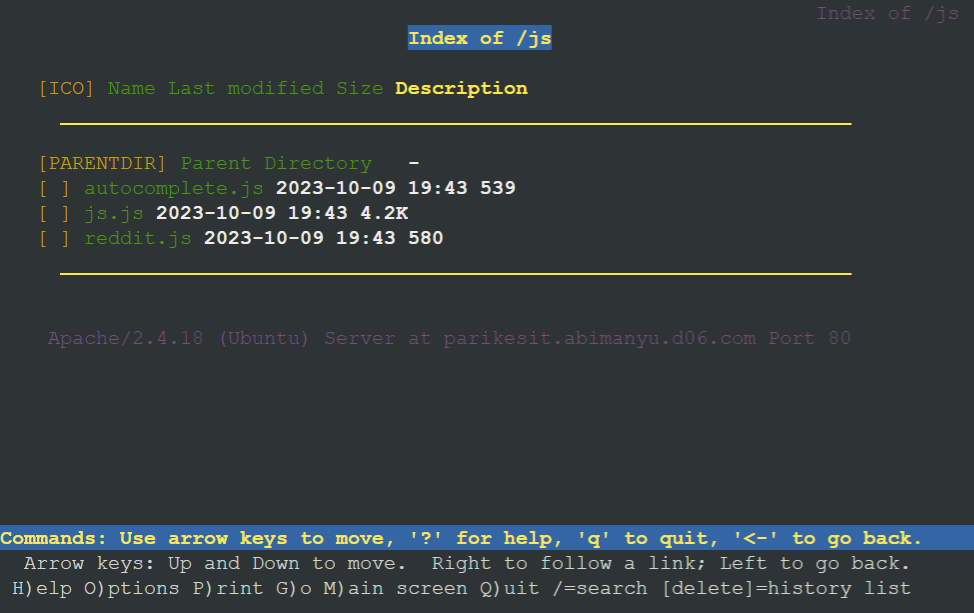

## No 17
Agar aman, buatlah konfigurasi agar www.rjp.baratayuda.abimanyu.yyy.com hanya dapat diakses melalui port 14000 dan 14400.

**Jawab**

Setup terlebih dahulu di worker `Abimanyu`

- Abimanyu
```
mkdir /var/www/rjp.baratayuda.abimanyu.D06

echo -e '<VirtualHost *:14000 *:14400>
  ServerAdmin webmaster@localhost
  DocumentRoot /var/www/rjp.baratayuda.abimanyu.D06
  ServerName rjp.baratayuda.abimanyu.D06.com
  ServerAlias www.rjp.baratayuda.abimanyu.D06.com

  ErrorDocument 404 /error/404.html
  ErrorDocument 403 /error/403.html

  ErrorLog ${APACHE_LOG_DIR}/error.log
  CustomLog ${APACHE_LOG_DIR}/access.log combined
</VirtualHost>' > /etc/apache2/sites-available/rjp.baratayuda.abimanyu.D06.com.conf

echo -e '# If you just change the port or add more ports here, you will likely also
# have to change the VirtualHost statement in
# /etc/apache2/sites-enabled/000-default.conf

Listen 80
Listen 14000
Listen 14400

<IfModule ssl_module>
        Listen 443
</IfModule>

<IfModule mod_gnutls.c>
        Listen 443
</IfModule>

# vim: syntax=apache ts=4 sw=4 sts=4 sr noet' > /etc/apache2/ports.conf

wget --no-check-certificate "https://drive.google.com/uc?export=download&id=1pPSP7yIR05JhSFG67RVzgkb-VcW9vQO6" -O /var/www/rjp.baratayuda.abimanyu.D06/rjp.baratayuda.abimanyu.D06.com.zip

unzip /var/www/rjp.baratayuda.abimanyu.D06/rjp.baratayuda.abimanyu.D06.com.zip -d /var/www/rjp.baratayuda.abimanyu.D06/

mv /var/www/rjp.baratayuda.abimanyu.D06/rjp.baratayuda.abimanyu.yyy.com/anya-bond.webp /var/www/rjp.baratayuda.abimanyu.D06/
mv /var/www/rjp.baratayuda.abimanyu.D06/rjp.baratayuda.abimanyu.yyy.com/loid.png /var/www/rjp.baratayuda.abimanyu.D06/
mv /var/www/rjp.baratayuda.abimanyu.D06/rjp.baratayuda.abimanyu.yyy.com/waku.mp3 /var/www/rjp.baratayuda.abimanyu.D06/
mv /var/www/rjp.baratayuda.abimanyu.D06/rjp.baratayuda.abimanyu.yyy.com/yor.jpg /var/www/rjp.baratayuda.abimanyu.D06/

rm -r /var/www/rjp.baratayuda.abimanyu.D06/rjp.baratayuda.abimanyu.D06.com.zip
rm -r /var/www/rjp.baratayuda.abimanyu.D06/rjp.baratayuda.abimanyu.yyy.com/

a2ensite rjp.baratayuda.abimanyu.D06.com.conf
service apache2 restart
```

- Client Nakula & Sadewa
```
lynx rjp.baratayuda.abimanyu.D06.com:14000
lynx rjp.baratayuda.abimanyu.D06.com:14400
```

Apabila berhasil maka pada console `Client` akan muncul sebagai berikut

`SS Hasil`

Port 14400 atau 14000

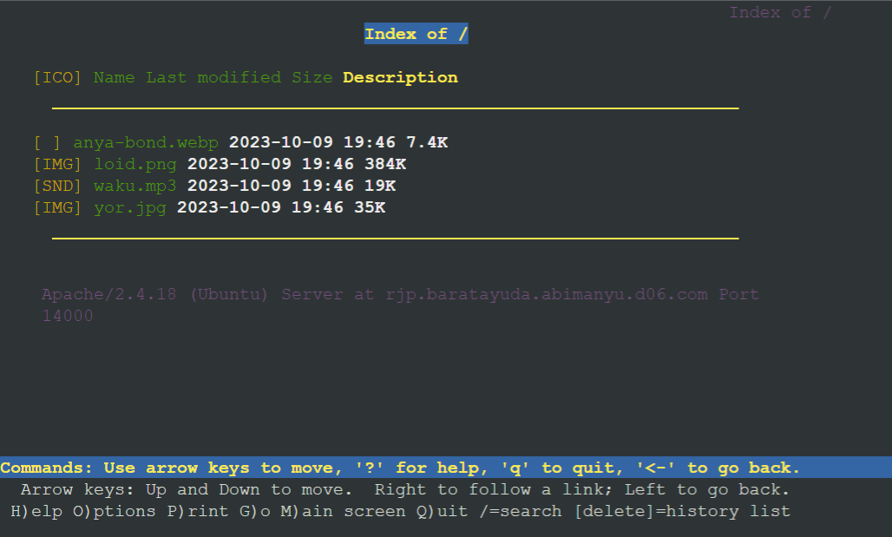

Selain port 14400 dan 14000

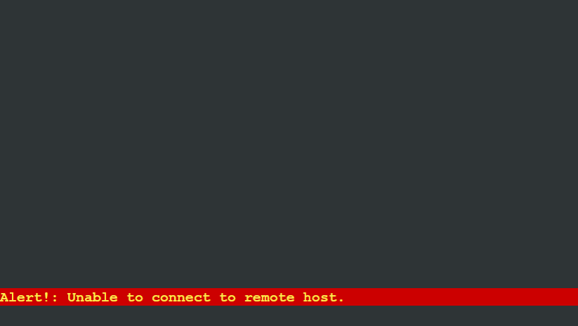

## No 18
Untuk mengaksesnya buatlah autentikasi username berupa “Wayang” dan password “baratayudayyy” dengan yyy merupakan kode kelompok. Letakkan DocumentRoot pada /var/www/rjp.baratayuda.abimanyu.yyy.

**Jawab**

Setup terlebih dahulu di worker `Abimanyu`

- Abimanyu
```
echo -e '<VirtualHost *:14000 *:14400>
  ServerAdmin webmaster@localhost
  DocumentRoot /var/www/rjp.baratayuda.abimanyu.D06
  ServerName rjp.baratayuda.abimanyu.D06.com
  ServerAlias www.rjp.baratayuda.abimanyu.D06.com

  <Directory /var/www/rjp.baratayuda.abimanyu.D06>
          AuthType Basic
          AuthName "Restricted Content"
          AuthUserFile /etc/apache2/.htpasswd
          Require valid-user
  </Directory>

  ErrorDocument 404 /error/404.html
  ErrorDocument 403 /error/403.html

  ErrorLog ${APACHE_LOG_DIR}/error.log
  CustomLog ${APACHE_LOG_DIR}/access.log combined
</VirtualHost>' > /etc/apache2/sites-available/rjp.baratayuda.abimanyu.D06.com.conf

a2ensite rjp.baratayuda.abimanyu.D06.com.conf
service apache2 restart
```
Tuliskan command berikut juga di worker `Abimanyu` untuk menyetting username dan password
```
htpasswd -c -b /etc/apache2/.htpasswd Wayang baratayudaD06
```
- `-c` adalah `created`
- `-b` adalah `bcrypy` untuk meng-hashing password

Selanjutnya dilakukan pengecekan pada `Client`
- Client Nakula & Sadewa
```
lynx rjp.baratayuda.abimanyu.D06.com:14000
lynx rjp.baratayuda.abimanyu.D06.com:14400
```

Apabila berhasil maka pada console `Client` akan muncul sebagai berikut

`SS Hasil`

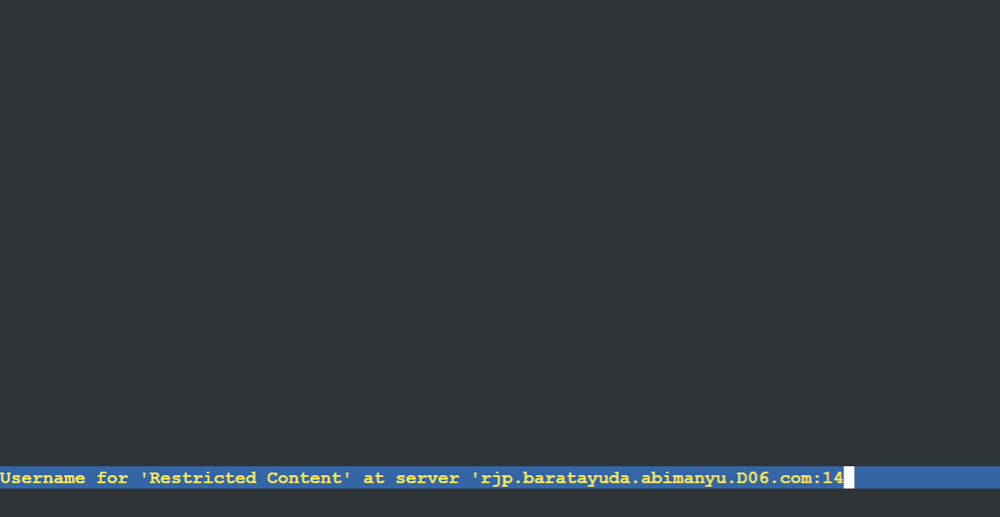

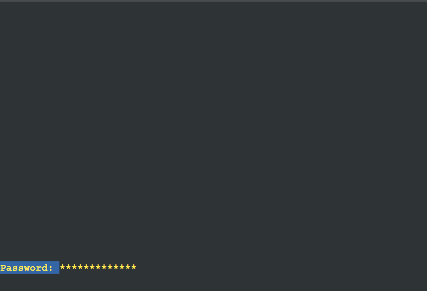

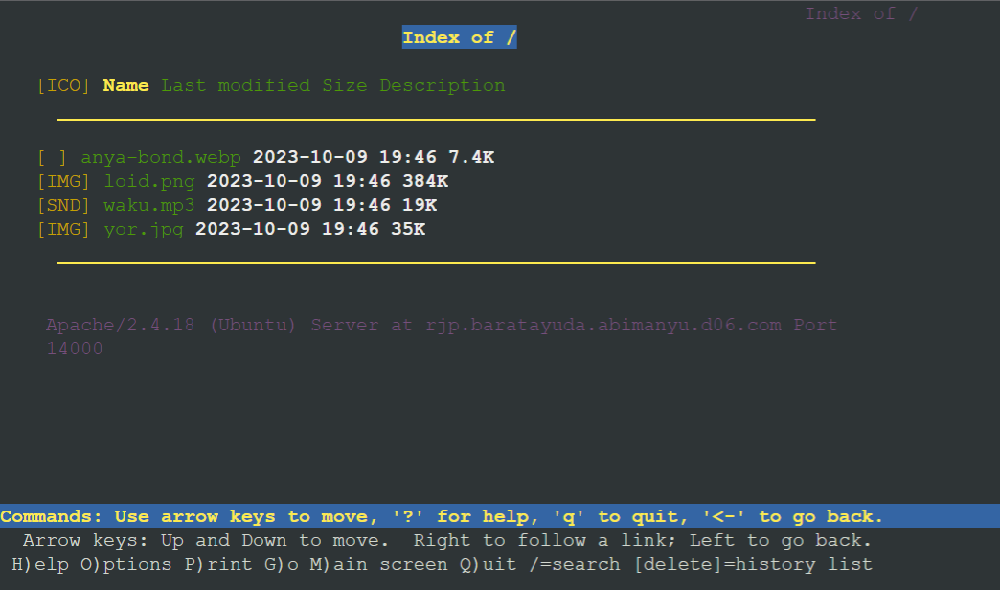

## No 19
Buatlah agar setiap kali mengakses IP dari Abimanyu akan secara otomatis dialihkan ke www.abimanyu.yyy.com (alias)

**Jawab**

Setup terlebih dahulu di worker `Abimanyu`

- Abimanyu
```
echo -e '<VirtualHost *:80>
    ServerAdmin webmaster@abimanyu.D06.com
    DocumentRoot /var/www/html

    ErrorLog ${APACHE_LOG_DIR}/error.log
    CustomLog ${APACHE_LOG_DIR}/access.log combined

    Redirect / http://www.abimanyu.D06.com/
</VirtualHost>' > /etc/apache2/sites-available/000-default.conf

apache2ctl configtest
service apache2 restart
```
Selanjutnya dilakukan pengecekan pada `Client` menggunakan IP dari worker `Abimanyu`
- Client Nakula & Sadewa
```
lynx 192.194.3.2
```

Apabila berhasil maka pada console `Client` akan muncul sebagai berikut

`SS Hasil`

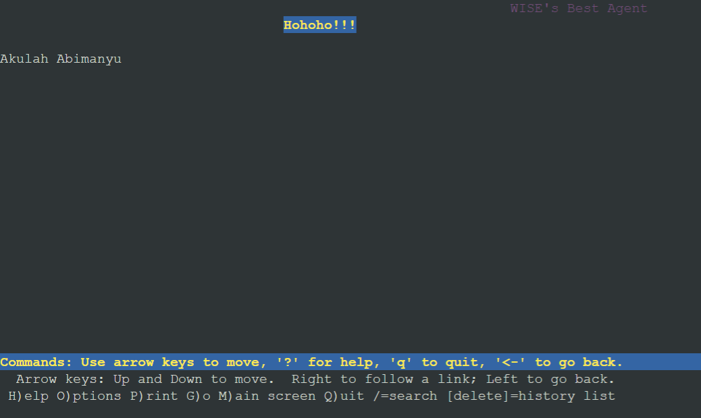

## No 20
Karena website www.parikesit.abimanyu.yyy.com semakin banyak pengunjung dan banyak gambar gambar random, maka ubahlah request gambar yang memiliki substring “abimanyu” akan diarahkan menuju abimanyu.png.

**Jawab**

Setup terlebih dahulu di worker `Abimanyu`

- Abimanyu
```
a2enmod rewrite

echo 'RewriteEngine On
RewriteCond %{REQUEST_URI} ^/public/images/(.*)(abimanyu)(.*\.(png|jpg))
RewriteCond %{REQUEST_URI} !/public/images/abimanyu.png
RewriteRule abimanyu http://parikesit.abimanyu.D06.com/public/images/abimanyu.png$1 [L,R=301]' > /var/www/parikesit.abimanyu.D06/.htaccess

echo -e '<VirtualHost *:80>
  ServerAdmin webmaster@localhost
  DocumentRoot /var/www/parikesit.abimanyu.D06

  ServerName parikesit.abimanyu.D06.com
  ServerAlias www.parikesit.abimanyu.D06.com

  <Directory /var/www/parikesit.abimanyu.D06/public>
          Options +Indexes
  </Directory>

  <Directory /var/www/parikesit.abimanyu.D06/secret>
          Options -Indexes
  </Directory>

  <Directory /var/www/parikesit.abimanyu.D06>
          Options +FollowSymLinks -Multiviews
          AllowOverride All
  </Directory>

  Alias "/public" "/var/www/parikesit.abimanyu.D06/public"
  Alias "/secret" "/var/www/parikesit.abimanyu.D06/secret"
  Alias "/js" "/var/www/parikesit.abimanyu.D06/public/js"

  ErrorDocument 404 /error/404.html
  ErrorDocument 403 /error/403.html

  ErrorLog ${APACHE_LOG_DIR}/error.log
  CustomLog ${APACHE_LOG_DIR}/access.log combined
</VirtualHost>' > /etc/apache2/sites-available/parikesit.abimanyu.D06.com.conf

service apache2 restart
```
Selanjutnya dilakukan pengecekan pada `Client`
- Client Nakula & Sadewa
```
lynx parikesit.abimanyu.D06.com/public/images/not-abimanyu.png
lynx parikesit.abimanyu.D06.com/public/images/abimanyu-student.jpg
lynx parikesit.abimanyu.D06.com/public/images/abimanyu.png
lynx parikesit.abimanyu.D06.com/public/images/notabimanyujustmuseum.177013
```

Apabila berhasil maka pada console `Client` akan muncul sebagai berikut

`SS Hasil`

not-abimanyu.png

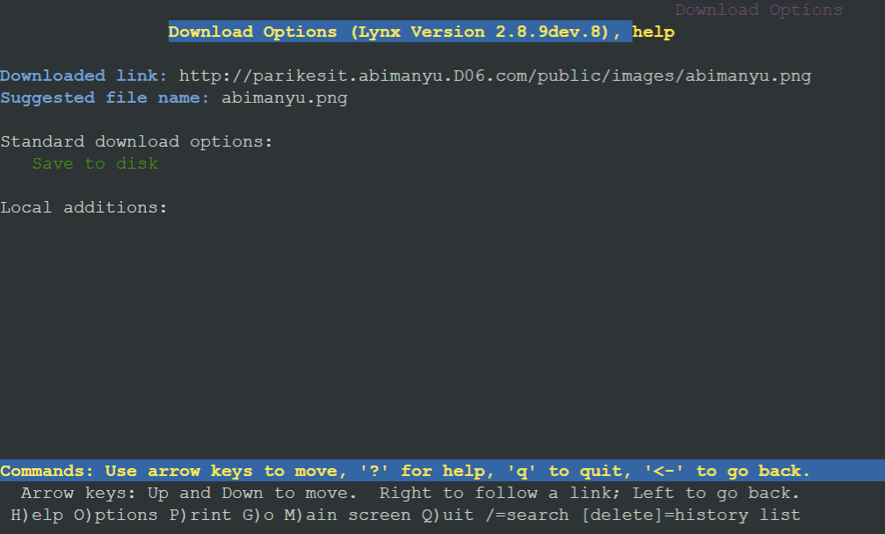

abimanyu-student.jpg

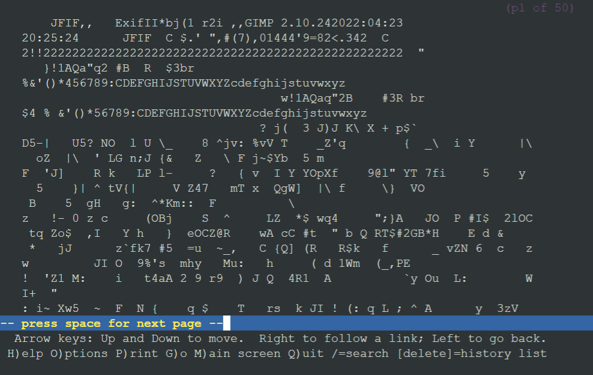

abimanyu.png


notabimanyujustmuseum.177013


